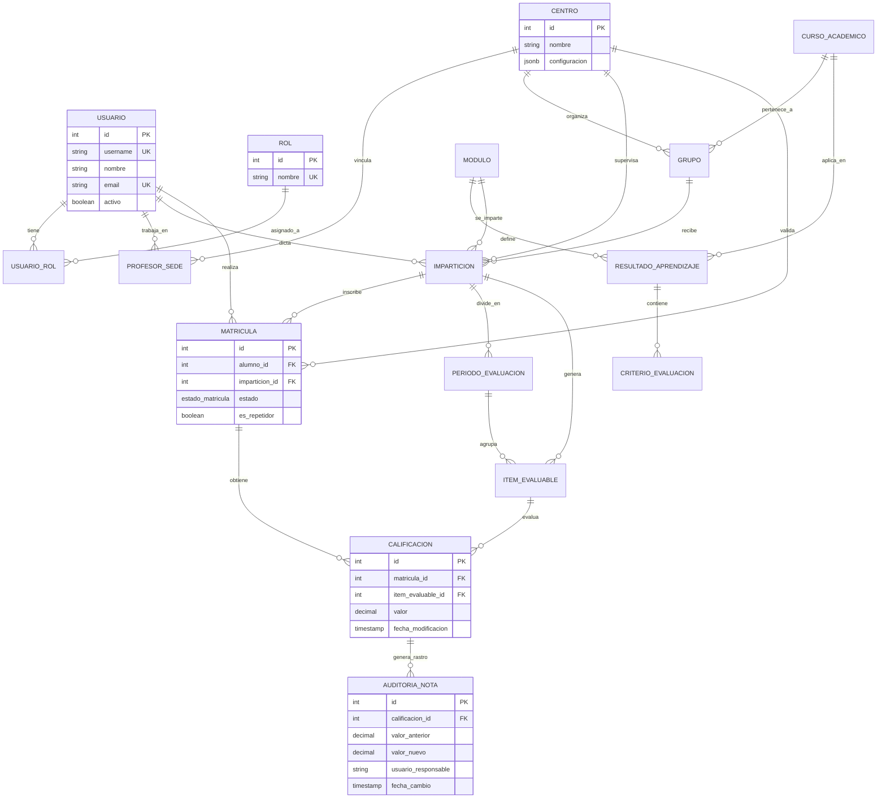

# 📊 Modelo de Datos y Diagrama de Entidad-Relación (ERD) - Schooledule

Este documento detalla el diseño del modelo de datos relacional de **Schooledule**, diseñado para soportar una gestión académica compleja en entornos multi-sede. El modelo se ha normalizado para garantizar la integridad referencial y se ha optimizado para permitir consultas eficientes sobre el progreso del alumnado.

## 📐 Diagrama de Entidad-Relación

---

## 📝 Desglose Técnico del Modelo

### 1. Configuración Curricular y Académica

El modelo implementa una jerarquía estricta para cumplir con las normativas educativas actuales:

- **MODULO y RESULTADO_APRENDIZAJE:** Los módulos definen los objetivos pedagógicos a través de resultados de aprendizaje, los cuales se desglosan en **CRITERIO_EVALUACION**. Esta estructura permite una evaluación competencial detallada.
- **CURSO_ACADEMICO:** Actúa como un eje temporal, permitiendo que la configuración curricular evolucione entre años sin perder el histórico de datos.

### 2. El Nodo Central: La Impartición

La entidad **IMPARTICION** es el pivot fundamental del sistema. Vincula cuatro dimensiones críticas:

- **Qué:** El Módulo profesional.
- **Quién:** El Usuario (Profesor) que dicta la materia.
- **A quién:** El Grupo de alumnos que recibe la formación.
- **Dónde:** El Centro educativo que supervisa la actividad.
  Esta normalización permite gestionar de forma unificada horarios, periodos de evaluación y generación de ítems calificables.

### 3. Gestión de Matrícula y Aislamiento de Sedes

- **Multi-Tenencia:** La entidad **CENTRO** es la raíz de la seguridad. Mediante relaciones directas con `GRUPO`, `IMPARTICION` y `MATRICULA`, el sistema garantiza que un usuario solo pueda acceder a los registros del centro donde tiene permisos activos.
- **Estado de la Matrícula:** La entidad **MATRICULA** permite rastrear la situación del alumno (activo, baja, traslado) y si este es repetidor, afectando directamente al cálculo de medias y expedientes.

### 4. Ciclo de Evaluación y Auditoría Forense

El sistema de evaluación se ha diseñado para ser auditable y transparente:

- **ITEM_EVALUABLE:** Representa cualquier actividad evaluativa (exámenes, proyectos, etc.) asociada a una impartición y un periodo de evaluación concreto.
- **AUDITORIA_NOTA:** Es el componente de integridad crítica. Ante cualquier actualización de la tabla `CALIFICACION`, se dispara una inserción obligatoria en esta tabla. Se registra el valor previo, el nuevo, la fecha exacta y el usuario responsable, garantizando que el historial académico sea inalterable y plenamente auditable.

### 5. Identidad y Roles N:M

La relación entre **USUARIO** y **ROL** mediante la tabla intermedia `USUARIO_ROL` elimina la rigidez de los perfiles únicos. Un usuario puede actuar como "Profesor" en una impartición y como "Administrador" de su sede simultáneamente, permitiendo una gestión de permisos granular y adaptable a la realidad de los centros docentes.

---

_Análisis detallado del modelo de datos elaborado para la Memoria de TFG - Schooledule 2026_
