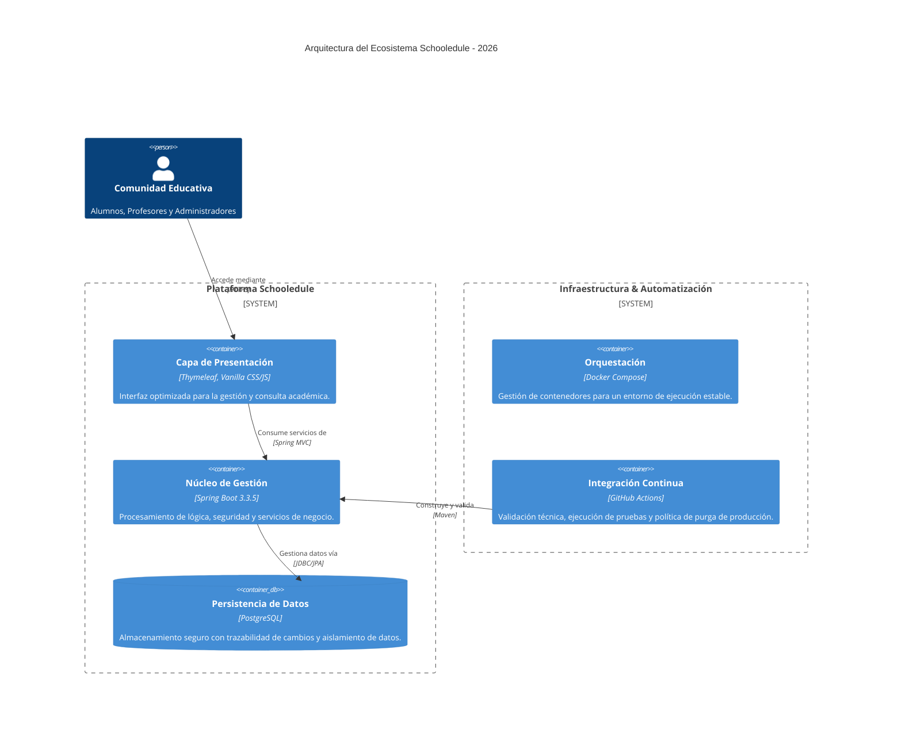

# 🏛️ Arquitectura de la Solución - Schooledule

Este documento describe la estructura técnica de la plataforma **Schooledule**, diseñada para centralizar la gestión académica en entornos multi-sede. La arquitectura se ha proyectado para ofrecer una solución robusta, escalable y, sobre todo, transparente tanto para el equipo docente como para el alumnado.

## 📋 Visión General del Sistema

La solución se fundamenta en un modelo de capas que separa claramente las responsabilidades, permitiendo que el mantenimiento y la evolución del software sean procesos ágiles y seguros. El objetivo principal es que la tecnología no sea una barrera, sino una herramienta de apoyo eficiente en el día a día educativo.

1.  **Capa de Presentación (Interfaz de Usuario):** Se ha optado por una combinación de **Thymeleaf** con **Vanilla CSS y JavaScript**. Esta elección busca minimizar la carga en el cliente y garantizar una respuesta rápida del sistema, proporcionando una interfaz limpia y profesional que facilite la gestión de notas y perfiles.
2.  **Capa de Lógica de Negocio (Servidor):** El núcleo de la aplicación está desarrollado con **Spring Boot 3.3.5** y **Java 21**. Esta capa orquesta todas las reglas académicas, desde la gestión de matrículas hasta la validación de roles (RBAC). El uso de Java 21 permite aprovechar las últimas mejoras en rendimiento y concurrencia.
3.  **Capa de Datos (Persistencia):** La base de datos **PostgreSQL** actúa como el pilar de integridad. Se ha implementado un sistema de **Auditoría Forense** que registra cualquier modificación en las calificaciones, asegurando que el historial académico sea fiable y auditable en todo momento.

---

## 🎨 Diagrama de Contenedores

---

## ⚙️ Ciclo de Calidad y Despliegue (CI/CD)

Para garantizar que el software entregado cumpla con los estándares de un entorno profesional, el flujo de desarrollo sigue un protocolo estricto de automatización:

- **Auditoría de Estilo (Linting):** Se verifica automáticamente que el código cumpla con las guías de estilo y calidad técnica.
- **Barreras de Calidad (Quality Gates):** Ninguna funcionalidad se integra sin haber superado una cobertura mínima del **80% en pruebas unitarias e integrales** mediante JaCoCo.
- **Política de Registro Limpio (Purge Policy):** En la fase final de despliegue, el sistema elimina toda la documentación de trabajo interna y herramientas de desarrollo. El resultado es una versión de producción "purgada", optimizada y libre de ruido técnico, lista para ser utilizada por los centros educativos.

## 🏢 Gestión Multi-Sede y Seguridad

Uno de los pilares del proyecto es el **Aislamiento Multi-Sede**. A través del identificador `centro_id`, el sistema segrega la información de cada instituto de forma efectiva. Esto garantiza que cada entidad gestione sus propios alumnos, profesores y configuraciones sin interferencias, manteniendo la privacidad y la integridad de los datos en toda la red de centros.

---

_Documentación técnica elaborada para la Memoria de TFG - Schooledule 2026_
