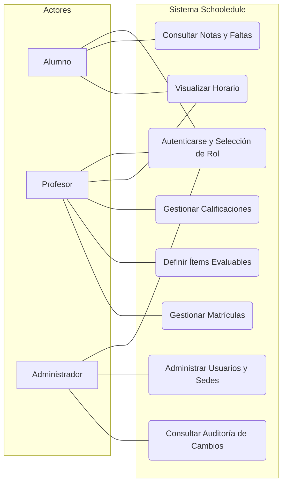

# 📝 Diagrama de Casos de Uso - Schooledule

Este documento detalla las interacciones funcionales de los diferentes actores con la plataforma **Schooledule**. El objetivo es definir claramente qué acciones puede realizar cada perfil, asegurando que la arquitectura de seguridad (RBAC) se alinee con las necesidades operativas de los centros educativos.

## 👥 Actores del Sistema

1.  **Alumno:** Usuario final que consulta su progreso académico, horarios y perfil personal.
2.  **Profesor:** Responsable de la gestión académica de sus módulos, evaluación de ítems y seguimiento del alumnado.
3.  **Administrador:** Perfil con privilegios elevados para la gestión de la infraestructura del centro, usuarios y auditoría del sistema.

---

## 🗺️ Diagrama de Casos de Uso

---

## 📄 Descripción de los Casos de Uso Principales

### 1. Gestión de Identidad y Acceso

- **Autenticarse y Selección de Rol:** Todos los usuarios deben identificarse. Dado que un usuario puede tener múltiples roles (ej. ser administrador y profesor), el sistema permite seleccionar el perfil activo al iniciar la sesión.

### 2. Interacciones del Alumnado

- **Consultar Notas:** Acceso a las calificaciones obtenidas en los diferentes ítems evaluables y resultados de aprendizaje.
- **Visualizar Horario:** Consulta de la planificación semanal y periodos lectivos.

### 3. Gestión Docente

- **Gestionar Calificaciones:** El profesor puede introducir y modificar notas. Estas acciones están sujetas al sistema de auditoría.
- **Definir Ítems Evaluables:** Configuración de las actividades y criterios que componen la evaluación de un módulo.

### 4. Administración y Control

- **Administrar Usuarios y Sedes:** Gestión de altas, bajas y asignación de centros a través del sistema multi-sede.
- **Consultar Auditoría:** Herramienta crítica para el administrador que permite rastrear quién, cuándo y por qué se modificó una calificación, garantizando la transparencia del proceso.

---

_Documentación funcional elaborada para la Memoria de TFG - Schooledule 2026_
