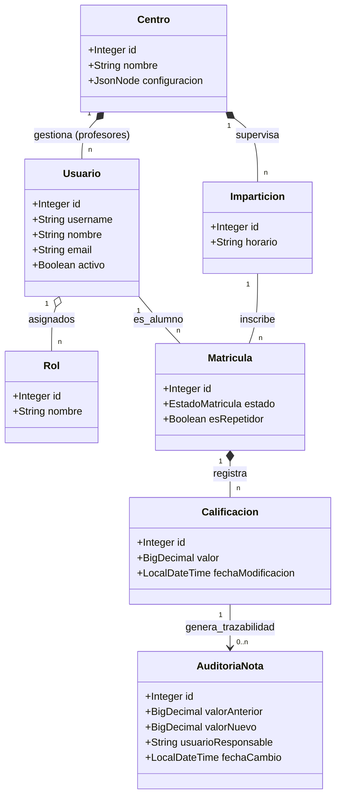

# 🏛️ Diagrama de Clases - Schooledule

Este documento presenta el diagrama de clases del dominio de la plataforma **Schooledule**. Se enfoca en las entidades principales y sus relaciones, proporcionando una visión técnica de cómo se estructuran los datos y la lógica de negocio en el servidor.

## 📋 Descripción de Entidades Principales

El modelo de dominio se ha diseñado siguiendo principios de **Diseño Orientado al Dominio (DDD)**, asegurando que cada clase tenga una responsabilidad clara y coherente con las reglas académicas.

1.  **Gestión de Usuarios y Seguridad:**
    - **Usuario:** Clase central que representa a cualquier persona que accede al sistema.
    - **Rol:** Define los permisos y capacidades de un usuario. La relación es N:M (gestada por una tabla intermedia), permitiendo la polivalencia de perfiles.
2.  **Estructura Organizativa:**
    - **Centro:** Representa la sede física y lógica. Es el eje del aislamiento de datos (multi-sede).
    - **Grupo:** Agrupación de alumnos en un curso y año académico específico.
3.  **Proceso Académico:**
    - **Matricula:** Vincula a un alumno con una impartición específica en un centro. Gestiona el estado académico (activo, baja, etc.).
    - **Calificacion:** Almacena el resultado numérico de un ítem evaluable para una matrícula concreta.
    - **AuditoriaNota:** Clase especializada en la trazabilidad inmutable de cualquier cambio realizado en una calificación.

---

## 🎨 Diagrama de Clases (UML)

---

## 🛠️ Relaciones y Lógica de Negocio

- **Composición vs Agregación:** Se ha utilizado composición (diamante relleno) en casos donde la vida de la entidad secundaria depende estrictamente de la principal (ej. un Centro y sus Imparticiones).
- **Trazabilidad Inmutable:** La relación entre `Calificacion` y `AuditoriaNota` es unidireccional. La auditoría nunca se modifica, solo se crean nuevos registros ante cambios en la calificación, garantizando la integridad forense del sistema.
- **Aislamiento Multi-Sede:** Aunque no se muestra en todos los atributos por brevedad, la relación con `Centro` es transversal a todas las operaciones de persistencia para garantizar la segregación de datos.

---

_Documentación técnica de arquitectura de clases para la Memoria de TFG - Schooledule 2026_
